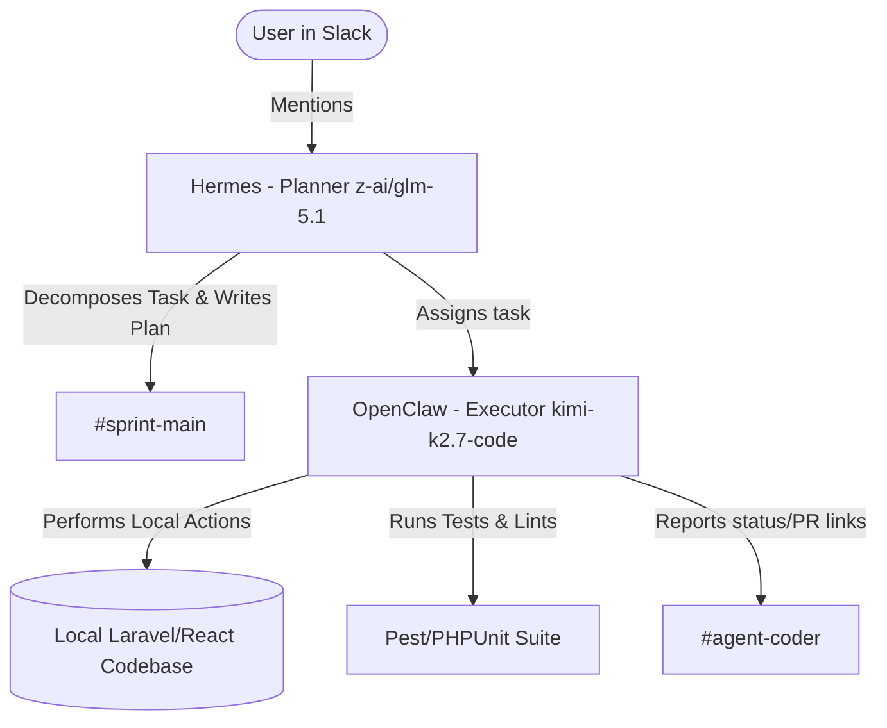

# Architecture Design — PulseDesk

PulseDesk is a multi-tenant support ticket system where organizations manage their users, agents, and support tickets in complete isolation.

## 1. Multi-Tenancy Strategy
- **Isolation Level:** Database-level logical isolation (Shared Database, Shared Schema).
- **Tenant Scope:** Every tenant is represented by an `organizations` record.
- **Scoping Key:** The `organization_id` foreign key is required on every data table (e.g., `users`, `tickets`, `replies`).
- **Enforcement:** Global Query Scopes in Laravel models (e.g., a custom `TenantScope` class or `belongsTo(Organization::class)` relationship checking) to ensure Org A can never see or modify Org B's data under any API request.

## 2. Database Schema Design (Proposed)

### `organizations`
- `id` (bigint, PK)
- `name` (varchar)
- `slug` (varchar, unique)
- `timestamps`

### `users`
- `id` (bigint, PK)
- `organization_id` (bigint, FK)
- `name` (varchar)
- `email` (varchar, unique within organization)
- `password` (varchar)
- `role` (enum: 'admin', 'agent', 'customer')
- `timestamps`

### `tickets`
- `id` (bigint, PK)
- `organization_id` (bigint, FK)
- `subject` (varchar)
- `description` (text)
- `status` (enum: 'open', 'pending', 'resolved', 'closed')
- `priority` (enum: 'low', 'medium', 'high', 'urgent')
- `requester_id` (bigint, FK to `users` - customer who raised it)
- `assignee_id` (bigint, FK to `users` - agent assigned, nullable)
- `tags` (json / text)
- `timestamps`

### `comments`
- `id` (bigint, PK)
- `organization_id` (bigint, FK)
- `ticket_id` (bigint, FK)
- `user_id` (bigint, FK)
- `body` (text)
- `is_internal` (boolean - true if agents-only note, false if customer-visible reply)
- `timestamps`

---

## 3. API Routes Layout
All API endpoints will be scoped under `/api/v1` and protected by Laravel Sanctum:

- `POST /api/v1/auth/register` — Register a new organization and admin user
- `POST /api/v1/auth/login` — Login to receive a Sanctum token
- `POST /api/v1/auth/logout` — Revoke token
- `GET /api/v1/tickets` — List tickets scoped by active user's tenant organization (with search/filter query parameters)
- `POST /api/v1/tickets` — Create a ticket
- `GET /api/v1/tickets/{id}` — Fetch ticket detail & comment thread
- `PUT /api/v1/tickets/{id}` — Update ticket (change status, assign agent, etc.)
- `POST /api/v1/tickets/{id}/comments` — Add a new public comment or internal note

---

## 4. Model Routing & Execution Flow

- **Planning (Hermes):** Evaluates complexity, coordinates sprints, designs schemas, and ensures multi-tenant policies are correctly identified before assigning files to be modified.
- **Execution (OpenClaw):** Focuses on low-level coding task speed, follows Laravel best practices, writes tests, and runs validations.
